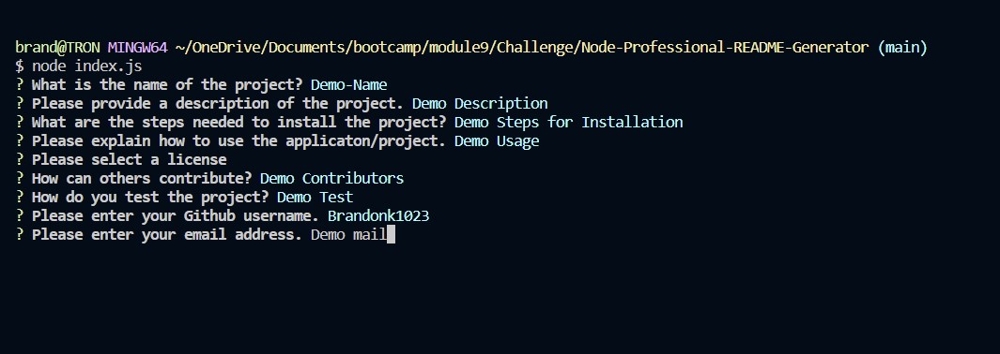

# Node-Professional-README-Generator

## Description

The aim of building the project was to create a CLI based application to dynamically create README files for the end user.  This would allow for very easy README generation that could be used for future projects.  This solved the issues of having to manually create one each time it was needed, and allowed for more efficient creation.  Im working on this project I was able to learn more about node.js, inquirer, npm, and building a CLI based application in JavaScript.

## Table of Contents

- [Installation](#installation)
- [Usage](#usage)
- [Credits](#credits)
- [License](#license)

## Installation

Installation of this application requires that you run npm to install the needed dependencies for fs and inquirer.

## Usage

To use application, open the application in the terminal by using the following command "node index.js". The user will be prompted through a series of questions related to the README file that needs to be created.  The information entered in will be filled into the README file for the project.  Once completed the application will generate the project README file for the user.

## Credits

Starter Code REPO URL:
https://github.com/coding-boot-camp/potential-enigma

Starter Code Contributers:

Xandromus:
https://github.com/Xandromus

gachoi06:
https://github.com/gachoi06

## License

MIT License

